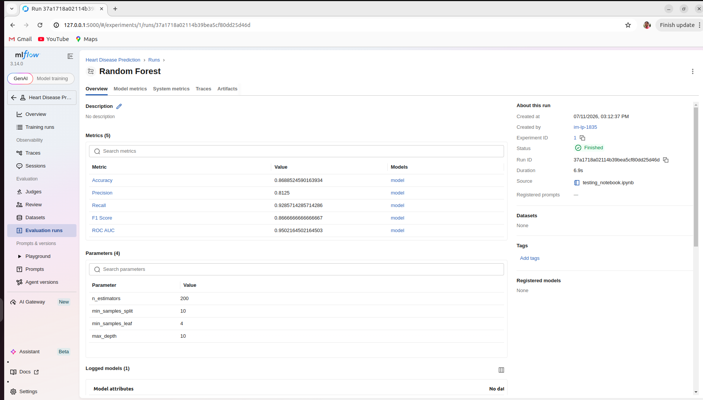
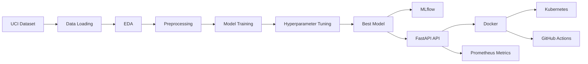
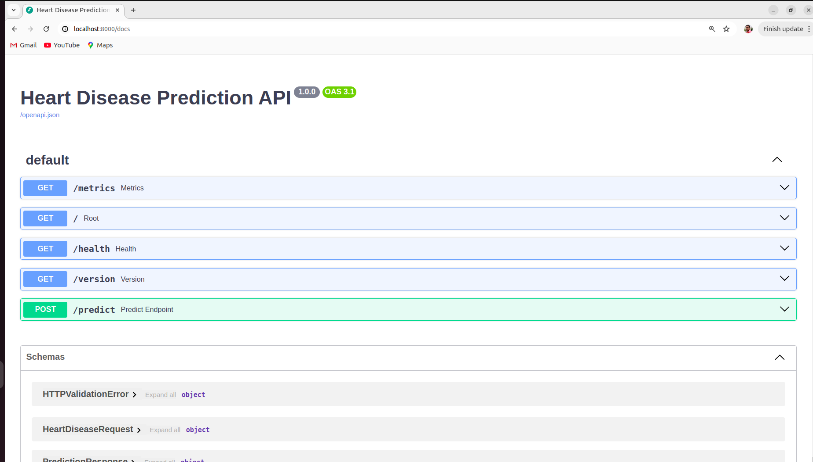
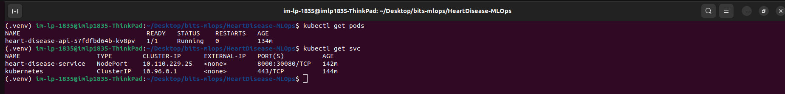
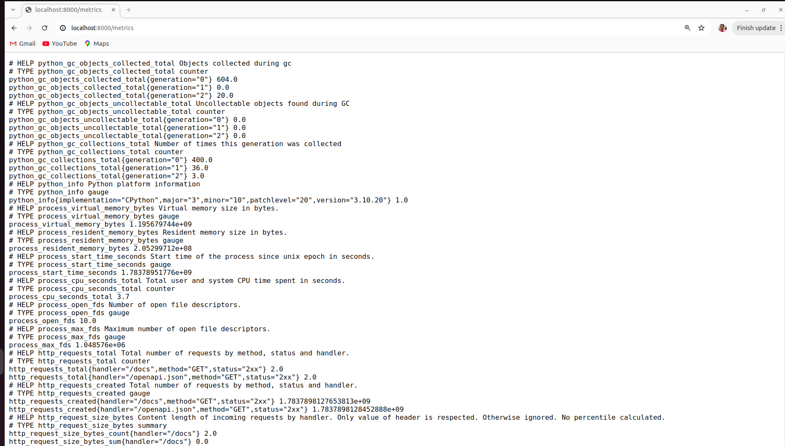
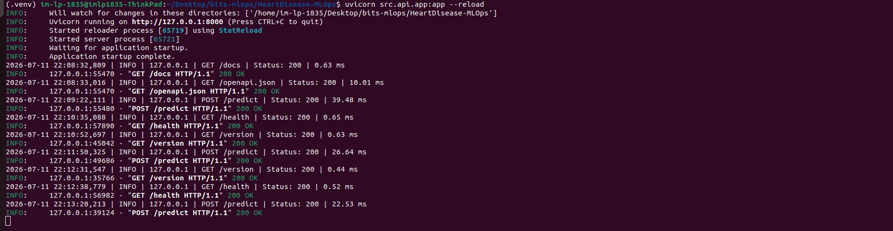
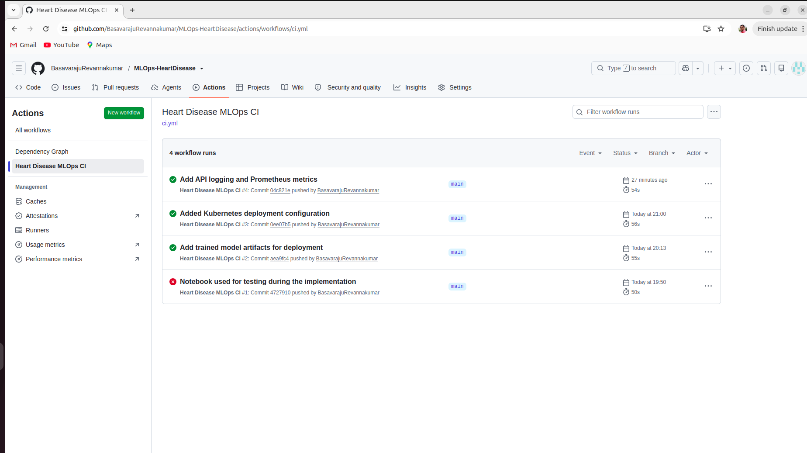

# Heart Disease Prediction using MLOps

## 1. Project Overview

This project implements an end-to-end MLOps pipeline for predicting the presence of heart disease using the UCI Cleveland Heart Disease dataset. The solution demonstrates data preprocessing, exploratory data analysis (EDA), machine learning model development, experiment tracking using MLflow, REST API deployment with FastAPI, Docker containerization, Kubernetes deployment using Minikube, GitHub Actions CI, and API monitoring using Prometheus metrics.

## 2. Technology Stack

Development machine - Ubuntu 22.04

| Component            | Technology            |
| -------------------- | --------------------- |
| Programming Language | Python 3.10           |
| Machine Learning     | Scikit-learn          |
| Data Analysis        | Pandas, NumPy         |
| Visualization        | Matplotlib, Seaborn   |
| Experiment Tracking  | MLflow                |
| API Framework        | FastAPI               |
| API Documentation    | Swagger UI (OpenAPI)  |
| Containerization     | Docker                |
| Orchestration        | Kubernetes (Minikube) |
| CI/CD                | GitHub Actions        |
| Monitoring           | Prometheus Metrics    |
| Logging              | FastAPI Middleware    |

## 3. Setup & Installation

#### Clone Repository

git clone https://github.com/BasavarajuRevannakumar/MLOps-HeartDisease.git
cd MLOps-HeartDisease

#### Create Virtual Environment

python3 -m venv .venv
source .venv/bin/activate

#### Install Dependencies

pip install -r requirements.txt

#### Download Dataset

Download the Processed Cleveland Heart Disease Dataset from the UCI Machine Learning Repository and place it in: data/raw/

## 4. Exploratory Data Analysis (EDA)

##### The following preprocessing and exploratory analysis were performed:
- Dataset inspection
- Missing value analysis
- Feature distribution analysis
- Correlation heatmap
- Target class distribution
- Statistical summary
- Feature scaling

##### EDA Findings
- Dataset contains 303 patient records.
- Missing values were identified and handled appropriately.
- Target classes are reasonably balanced.
- Certain clinical attributes (e.g., chest pain type, maximum heart rate, exercise-induced angina) show strong correlation with the target variable.

## 5. Model Development

##### The machine learning pipeline consists of:

- Data preprocessing
- Feature scaling
- Train-test split
- Model training
- Hyperparameter tuning
- Model evaluation
- Model serialization

### Evaluation Metrics

| Model                 | Accuracy | Precision | Recall   | F1 Score | ROC AUC |
|-----------------------|---------:|----------:|---------:|---------:|--------:|
| Logistic Regression   | 0.885246 | 0.838710  | 0.928571 | 0.881356 | 0.966450 |
| Random Forest         | 0.868852 | 0.812500  | 0.928571 | 0.866667 | 0.942641 |

## 6. Experiment Tracking (MLflow)

##### MLflow was used to:

- Track experiments
- Record hyperparameters
- Log evaluation metrics
- Store trained models

## 7. Architecture Diagram

## 8. REST API

##### The project exposes REST endpoints using FastAPI.

| Endpoint      | Description              |
| ------------- | ------------------------ |
| GET /         | Welcome endpoint         |
| GET /health   | Health check             |
| POST /predict | Heart disease prediction |
| GET /metrics  | Prometheus metrics       |

#### Swagger documentation:
http://localhost:8000/docs

## 9. Docker Deployment

- Build image : 
    docker build -t heart-disease-api:1.0 .
- Run container: 
    docker run -p 8000:8000 heart-disease-api:1.0

## 10. Kubernetes Deployment

- Deploy application:
    kubectl apply -f k8s/
- Verify deployment:
    kubectl get pods
    kubectl get svc

## 11. Monitoring & Logging

##### API request logging was implemented using FastAPI middleware.

##### Monitoring was implemented using:

- Prometheus FastAPI Instrumentator
- /metrics endpoint

##### Example metrics include:

- HTTP request count
- Request duration
- CPU usage
- Memory usage

## 12. CI/CD Workflow

Continuous Integration was implemented using GitHub Actions.

The workflow automatically:

- Installs dependencies
- Executes unit tests
- Validates project build

## 13. Deployment Workflow

Developer

↓

GitHub Repository

↓

GitHub Actions

↓

Docker Image

↓

Kubernetes (Minikube)

↓

FastAPI Service

↓

Prediction API

## 14. Conclusion

This project demonstrates a complete MLOps workflow, including data ingestion, preprocessing, machine learning model development, experiment tracking, REST API deployment, Docker containerization, Kubernetes orchestration, CI automation, and API monitoring. The implementation follows modular software engineering practices and showcases an end-to-end deployment pipeline suitable for production-oriented machine learning applications.
